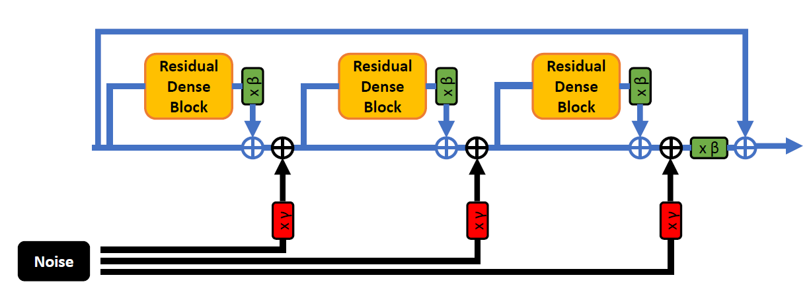
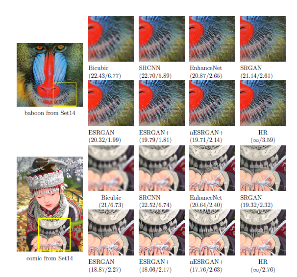

# ESRGAN+ nESRGAN+ Tarsier
## ICASSP 2020 - ESRGAN+ : Further Improving Enhanced Super-Resolution Generative Adversarial Network
### [Paper arXiv](https://arxiv.org/abs/2001.08073)
### [Paper IEEE Xplore](https://ieeexplore.ieee.org/document/9054071)
## ICPR 2020 - Tarsier: Evolving Noise Injection in Super-Resolution GANs
### [Paper arXiv](https://arxiv.org/abs/2009.12177)

  

  

### Dependencies

- Python 3 (Recommend to use [Anaconda](https://www.anaconda.com/download/#linux))
- [PyTorch >= 1.0.0](https://pytorch.org/)
- NVIDIA GPU + [CUDA](https://developer.nvidia.com/cuda-downloads)
- Python packages: `pip install numpy opencv-python lmdb tensorboardX`

## How to test
1. Place your low-resolution images in `test_image/LR` folder.
2. Download pretrained models from [Google Drive](https://drive.google.com/drive/folders/1lNky9afqEP-qdxrAwDFPJ1g0ui4x7Sin?usp=sharing) and place them in `test_image/pretrained_models`.
2. Run the command: `python test_image/test.py test_image/pretrained_models/nESRGANplus.pth` (or any other models).
3. The results are in `test_image/results` folder.

## How to train
1. Prepare the datasets which can be downloaded from [Google Drive](https://drive.google.com/drive/folders/1pRmhEmmY-tPF7uH8DuVthfHoApZWJ1QU).
2. Prepare the PSNR-oriented pretrained model (all pretrained models can be downloaded from [Google Drive](https://drive.google.com/drive/folders/1lNky9afqEP-qdxrAwDFPJ1g0ui4x7Sin?usp=sharing)).
2. Modify the configuration file `codes/options/train/train_ESRGANplus.json`.
3. Run the command `python train.py -opt codes/options/train/train_ESRGANplus.json`. 

## Acknowledgement
- This code is based on [BasicSR](https://github.com/xinntao/BasicSR).

## Citation

    @INPROCEEDINGS{9054071,
        author = {N. C. {Rakotonirina} and A. {Rasoanaivo}},  
        booktitle={ICASSP 2020 - 2020 IEEE International Conference on Acoustics, Speech and Signal Processing (ICASSP)},   
        title={ESRGAN+ : Further Improving Enhanced Super-Resolution Generative Adversarial Network},   
        year={2020},  
        volume={},  
        number={},  
        pages={3637-3641},}
